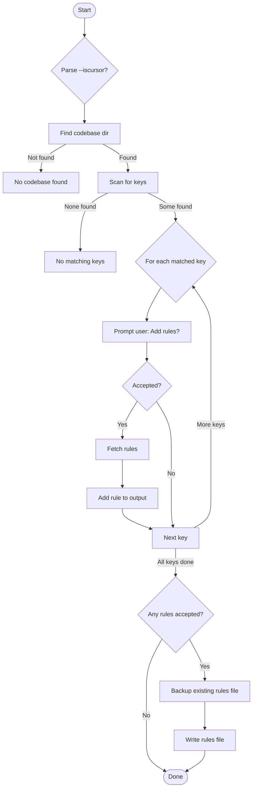

# RulesMaker: Windsurf/Codebase Rules Generator

This project provides a script (`generate_windsurfrules.py`) that scans a codebase, detects supported languages/frameworks, and interactively generates a `.windsurfrules` or `.cursorrules` file with best-practice coding rules for each detected technology.

---

## Code Execution Walkthrough

### 1. **Startup and Argument Parsing**
- The script starts by importing modules and defining constants.
- It parses the `--iscursor` argument to determine output file name (`.windsurfrules` or `.cursorrules`).

### 2. **Project Root and Rule Directory**
- Sets `PROJECT_ROOT` to the script's directory.
- Sets `RULES_DIR` to the local rules folder (if present).

### 3. **Finding the Codebase**
- Calls `find_codebase_dir(PROJECT_ROOT)` to locate a subdirectory containing a canonical project file (e.g., `package.json`, `pom.xml`, `build.gradle`, etc.).
- If no codebase is found, prints a message and exits.

### 4. **Framework/Language Detection**
- Calls `scan_for_keys_canonical(codebase_dir, KEYS)` to detect which frameworks/languages are present, based on files, extensions, and dependency checks.
- If no supported keys are found, prints a message and exits.

### 5. **Interactive Rule Selection**
- For each detected key, prompts the user: `Add rules for <key>? [y/N]: `
- If accepted, fetches rules for that key (using `fetch_rules_for_key_interactive`).
- Presents previews for each rule and asks for confirmation before adding.
- Gathers accepted and rejected rules per key.

### 6. **Rule File Writing**
- If any rules were accepted, backs up any existing rules file, then writes the new rules to `.windsurfrules` or `.cursorrules`.
- Prints a summary of accepted and rejected keys and rules.

### 7. **Exit**
- If no rules were accepted, no file is written and a summary is printed.

---

## Notes
- **IMPORTANT:** The `KEYS` list must match the available sections at cursor.directory/rules/.
- The script is interactive and requires user input for each detected key.
- The rules are fetched from a remote source (cursor.directory) and previewed before acceptance.
- Existing rules files are backed up before being overwritten.

---

## How to Run

```bash
python3 generate_windsurfrules.py        # writes .windsurfrules
python3 generate_windsurfrules.py --iscursor   # writes .cursorrules
```

Follow the prompts to select which rules to include for each detected framework/language.

---

## Code Execution Flow Diagram (Mermaid)



---

---

## fetch_and_convert_cursor_rules_to_windsurf.py (Automated Rule Sync)

Fetches all Cursor rules from the [awesome-cursor-rules-mdc](https://github.com/sanjeed5/awesome-cursor-rules-mdc/tree/main/rules-mdc) GitHub repo and converts them to the latest Windsurf format in `.windsurf/rules/`. Fully automated, requires your `GITHUB_TOKEN` environment variable. Run with:

```bash
python3 fetch_and_convert_cursor_rules_to_windsurf.py
```

---

## generate_windsurfrules_from_cursor_rules_list.py (Interactive, Code-aware Rule Sync)

Scans your local codebase to detect all supported languages, frameworks, and tools using robust heuristics (file extensions, build files, filenames, shebangs, modelines, and code markers). For each detected technology, it fetches the corresponding rule from the [awesome-cursor-rules-mdc](https://github.com/sanjeed5/awesome-cursor-rules-mdc/tree/main/rules-mdc) GitHub repo, converts it to the latest Windsurf format, and interactively prompts you to accept or reject each rule. Only accepted rules are written as individual `.md` files to `.windsurf/rules/`.

Requires your `GITHUB_TOKEN` environment variable. Run with:

```bash
python3 generate_windsurfrules_from_cursor_rules_list.py
```

---
